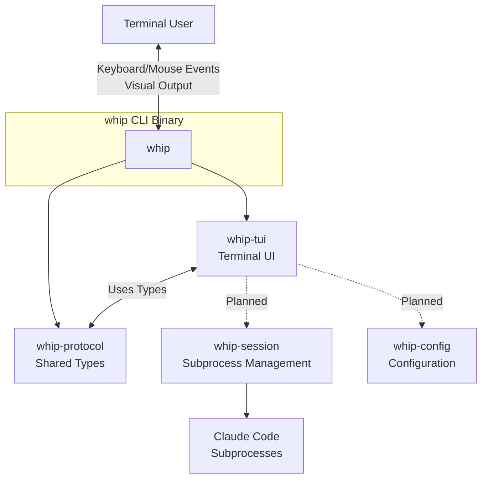
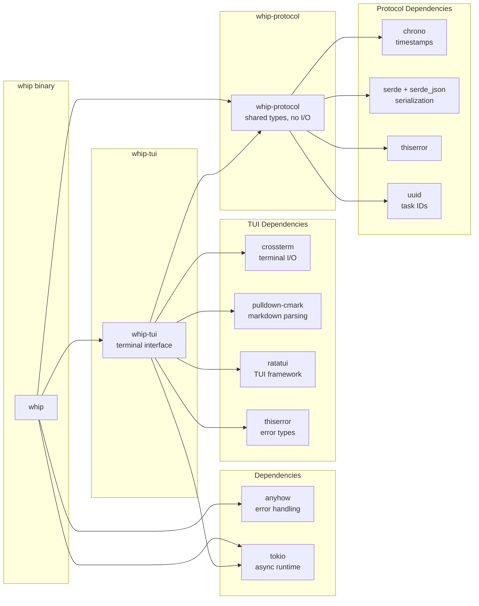
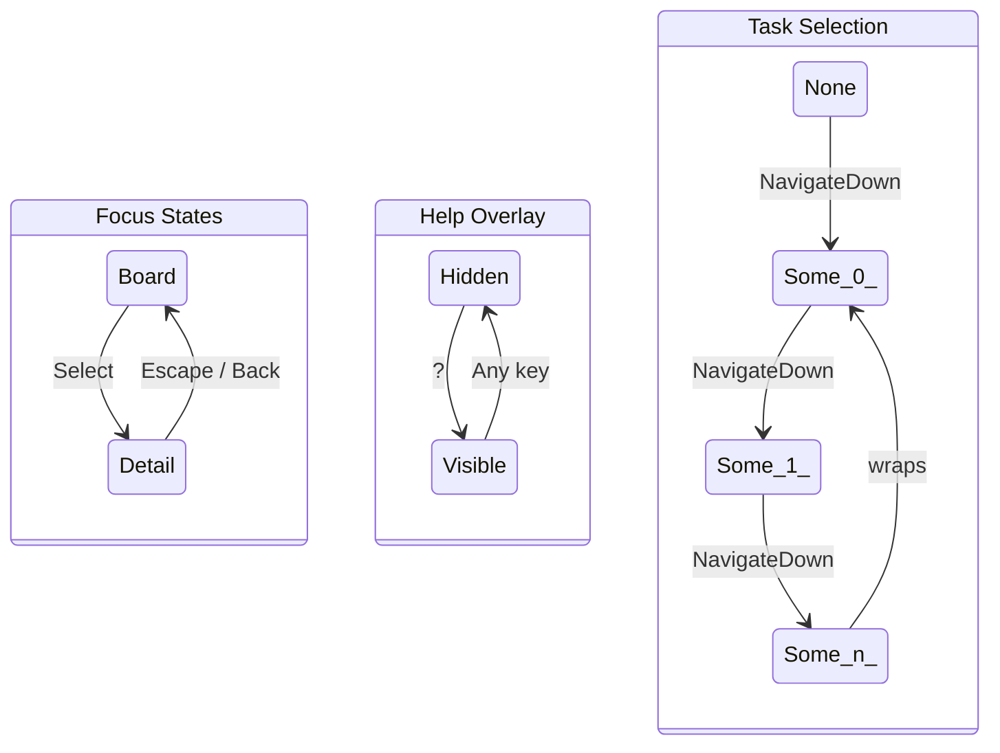

# whip Architecture

> A terminal UI application that supervises and orchestrates multiple Claude Code instances.

## High-Level Overview



## Crate Dependency Graph



## Crate Responsibilities

### whip (Root Binary)

**Location:** `/src/main.rs`

Entry point and orchestration:

- CLI argument parsing (planned: clap)
- Terminal setup/teardown lifecycle
- Panic hook installation for terminal restoration
- Main event loop coordination
- Process exit handling

### whip-protocol

**Location:** `/crates/protocol/src/`

Shared data types and contracts (no I/O dependencies):

| Module       | Purpose                                         |
| ------------ | ----------------------------------------------- |
| `task.rs`    | `Task`, `TaskId`, `TaskState` - work items      |
| `board.rs`   | `KanbanBoard`, `Lane`, `LaneKind` - board model |
| `message.rs` | `Message` - TUI input events                    |
| `error.rs`   | `ProtocolError` - domain-specific errors        |
| `dummy.rs`   | Test data generation with realistic markdown    |

**Design Decisions:**

- Pure data types, no I/O operations
- Serializable via serde for persistence/IPC
- `thiserror` for typed errors
- Property-based tests (proptest) for serialization roundtrips

### whip-tui

**Location:** `/crates/tui/src/`

Terminal user interface (Ratatui + crossterm):

| Module        | Purpose                                           |
| ------------- | ------------------------------------------------- |
| `app.rs`      | `App` - main struct, event loop, message dispatch |
| `state.rs`    | `AppState`, `Focus` - navigation state            |
| `event.rs`    | `poll_event()`, `key_to_message()` - input        |
| `terminal.rs` | Terminal setup, restore, panic hooks              |
| `widgets/`    | Rendering functions                               |

**Widget Modules:**

| Widget          | Renders                               |
| --------------- | ------------------------------------- |
| `board.rs`      | 4-lane Kanban board layout            |
| `lane.rs`       | Individual lane with scrolling tasks  |
| `task_card.rs`  | Compact task card with state coloring |
| `detail.rs`     | Full-screen task detail view          |
| `help.rs`       | Centered help overlay                 |
| `status_bar.rs` | Footer keybinding hints               |
| `markdown.rs`   | Markdown to styled Line conversion    |

## Data Flow

### Event Processing Loop

```mermaid
flowchart TB
    subgraph MainLoop[Main Loop]
        stdin[Terminal stdin] -->|poll_event| event[crossterm Event]
        event -->|key_to_message| msg[Message<br/>NavigateLeft, Select, etc.]
        msg -->|app.update| state

        subgraph state[AppState]
            board[board: KanbanBoard]
            focus[focus: Focus]
            selected[selected_lane, selected_task]
            flags[detail_visible, help_visible]
        end

        state -->|app.view| widgets

        subgraph widgets[Widgets]
            render_board[render_board]
            render_lane[render_lane]
            render_card[render_card]
            render_detail[render_detail_panel]
            render_help[render_help_overlay]
        end

        widgets --> frame[ratatui Frame/Buffer]
        frame --> stdout[Terminal stdout]
    end
```



### State Transitions



## Key Abstractions

### Message (Elm-like Architecture)

The TUI follows an Elm-inspired architecture where:

1. **Events** from terminal are converted to **Messages**
2. **Messages** are dispatched to **update()** to modify **State**
3. **State** is rendered to terminal via **view()**

```rust
pub enum Message {
    NavigateLeft, NavigateRight, NavigateUp, NavigateDown,
    Select, Back, Escape, Quit, Refresh, ToggleHelp,
    ClickAt { column: u16, row: u16 },
}
```

### TaskState (Domain Model)

Tasks have orthogonal concepts of **lane** (workflow stage) and **state** (execution status):

```
Lane (position):     Backlog -> InProgress -> UnderReview -> Done
State (status):      Idle | InFlight | NeedsAttention | Success | Failed
```

This separation allows:

- A task in "InProgress" lane to be "NeedsAttention" (blocked)
- A task in "Done" lane to be "Failed" (completed with error)

### Widget Rendering (Functional)

Widgets are pure functions: `fn render(state, area, buffer)`:

- No internal state
- Composable (board renders lanes, lanes render cards)
- Testable (snapshot tests with insta)

## Async Patterns

### Current Implementation

- `tokio::main` runtime
- Synchronous event polling with 100ms timeout
- No concurrent tasks yet (single-threaded UI loop)

### Planned Patterns (for whip-session)

- `tokio::process::Command` for subprocess spawning
- `tokio::sync::mpsc` channels for inter-component communication
- `tokio::select!` for multiplexing subprocess I/O with UI events
- Graceful shutdown with signal handling

## Extension Points

### Adding New Task States

1. Add variant to `TaskState` enum in `protocol/src/task.rs`
2. Add color in `tui/src/widgets/task_card.rs::state_color()`
3. Add indicator in `tui/src/widgets/detail.rs::state_indicator()`

### Adding New Message Types

1. Add variant to `Message` enum in `protocol/src/message.rs`
2. Add key binding in `tui/src/event.rs::key_to_message()`
3. Handle message in `tui/src/app.rs::update()`

### Adding New Widgets

1. Create module in `tui/src/widgets/`
2. Export from `tui/src/widgets/mod.rs`
3. Add snapshot tests in `tui/src/widgets/tests.rs`

## Testing Strategy

| Type        | Location           | Framework   | Purpose                  |
| ----------- | ------------------ | ----------- | ------------------------ |
| Unit        | `#[cfg(test)]`     | built-in    | Core logic               |
| Property    | Protocol crate     | proptest    | Serialization roundtrips |
| Snapshot    | TUI widgets        | insta       | Visual regression        |
| Integration | `tests/` (planned) | tokio::test | Cross-crate              |

## Configuration (Planned)

Configuration sources (priority high to low):

1. Command-line arguments
2. Environment variables (`WHIP_*`)
3. Local config (`./whip.toml`)
4. User config (`~/.config/whip/config.toml`)
5. Built-in defaults
