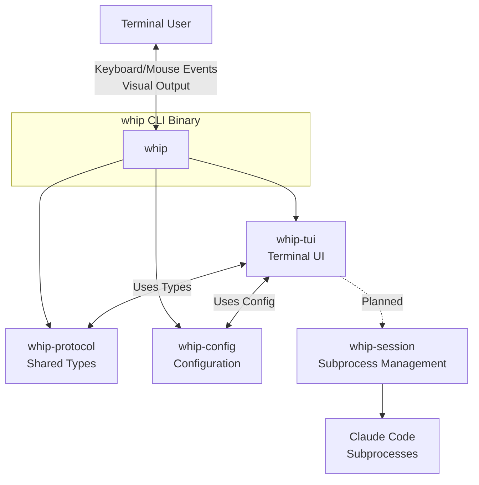
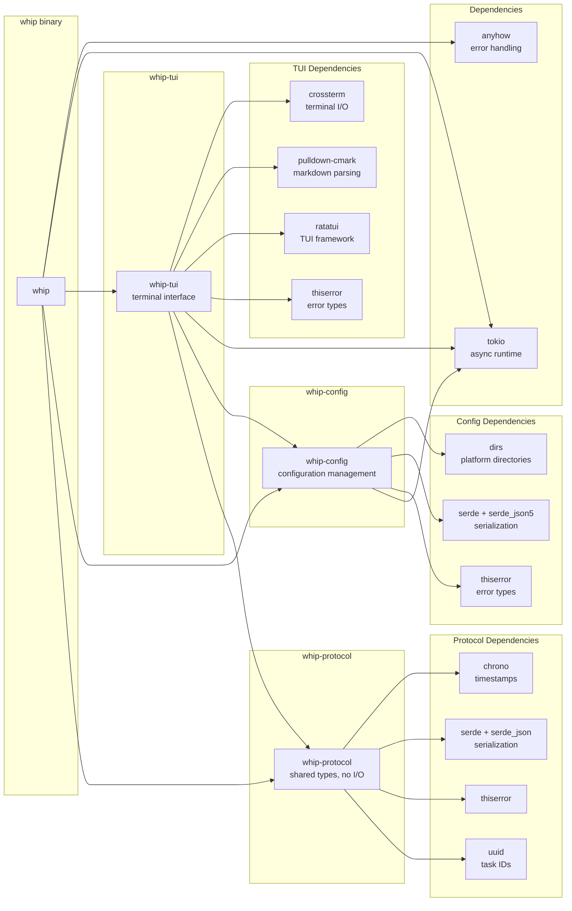

# whip Architecture

> A terminal UI application that supervises and orchestrates multiple Claude Code instances.

## High-Level Overview



## Crate Dependency Graph



## Crate Responsibilities

### whip (Root Binary)

**Location:** `/src/main.rs`

Entry point and orchestration:

- CLI argument parsing (planned: clap)
- Terminal setup/teardown lifecycle
- Panic hook installation for terminal restoration
- Main event loop coordination
- Process exit handling

### whip-config

**Location:** `/crates/config/src/`

Configuration management for loading, validating, and persisting settings:

| Module           | Purpose                                       |
| ---------------- | --------------------------------------------- |
| `config.rs`      | Main `Config` struct and loading logic        |
| `repository.rs`  | `Repository` type with flexible parsing       |
| `polling.rs`     | `PollingConfig` with rate-limit awareness     |
| `auth.rs`        | GitHub token resolution (repo/global/gh CLI)  |
| `persistence.rs` | Config file reading and writing               |
| `error.rs`       | `ConfigError` - configuration-specific errors |

**Design Decisions:**

- Supports JSON5 format for human-friendly config (comments, trailing commas)
- Token resolution chain: repo-specific -> global -> `gh auth token` -> unauthenticated
- Auto-adjusting polling intervals based on authentication status
- Platform-aware config paths via `dirs` crate

**Configuration Sources (Priority):**

1. Local config (`./whip.json5` or `./whip.json`)
2. User config (`~/.config/whip/config.json5` or `~/.config/whip/config.json`)
3. Built-in defaults

### whip-protocol

**Location:** `/crates/protocol/src/`

Shared data types and contracts (no I/O dependencies):

| Module       | Purpose                                         |
| ------------ | ----------------------------------------------- |
| `task.rs`    | `Task`, `TaskId`, `TaskState` - work items      |
| `board.rs`   | `KanbanBoard`, `Lane`, `LaneKind` - board model |
| `message.rs` | `Message` - TUI input events                    |
| `error.rs`   | `ProtocolError` - domain-specific errors        |
| `dummy.rs`   | Test data generation with realistic markdown    |

**Design Decisions:**

- Pure data types, no I/O operations
- Serializable via serde for persistence/IPC
- `thiserror` for typed errors
- Property-based tests (proptest) for serialization roundtrips

### whip-tui

**Location:** `/crates/tui/src/`

Terminal user interface (Ratatui + crossterm):

| Module              | Purpose                                           |
| ------------------- | ------------------------------------------------- |
| `app.rs`            | `App` - main struct, event loop, message dispatch |
| `state.rs`          | `AppState`, `Focus` - navigation state            |
| `settings_state.rs` | `SettingsState` - settings panel state            |
| `event.rs`          | `poll_event()`, `key_to_message()` - input        |
| `terminal.rs`       | Terminal setup, restore, panic hooks              |
| `widgets/`          | Rendering functions                               |

**Widget Modules:**

| Widget          | Renders                               |
| --------------- | ------------------------------------- |
| `board.rs`      | 4-lane Kanban board layout            |
| `lane.rs`       | Individual lane with scrolling tasks  |
| `task_card.rs`  | Compact task card with state coloring |
| `detail.rs`     | Full-screen task detail view          |
| `help.rs`       | Centered help overlay                 |
| `settings.rs`   | Configuration settings panel overlay  |
| `status_bar.rs` | Footer keybinding hints               |
| `markdown.rs`   | Markdown to styled Line conversion    |

## Data Flow

### Event Processing Loop


### State Transitions


## Key Abstractions

### Message (Elm-like Architecture)

The TUI follows an Elm-inspired architecture where:

1. **Events** from terminal are converted to **Messages**
2. **Messages** are dispatched to **update()** to modify **State**
3. **State** is rendered to terminal via **view()**

```rust
pub enum Message {
    NavigateLeft, NavigateRight, NavigateUp, NavigateDown,
    Select, Back, Escape, Quit, Refresh, ToggleHelp,
    ClickAt { column: u16, row: u16 },
}
```

### TaskState (Domain Model)

Tasks have orthogonal concepts of **lane** (workflow stage) and **state** (execution status):

```
Lane (position):     Backlog -> InProgress -> UnderReview -> Done
State (status):      Idle | InFlight | NeedsAttention | Success | Failed
```

This separation allows:

- A task in "InProgress" lane to be "NeedsAttention" (blocked)
- A task in "Done" lane to be "Failed" (completed with error)

### Widget Rendering (Functional)

Widgets are pure functions: `fn render(state, area, buffer)`:

- No internal state
- Composable (board renders lanes, lanes render cards)
- Testable (snapshot tests with insta)

## Async Patterns

### Current Implementation

- `tokio::main` runtime
- Synchronous event polling with 100ms timeout
- No concurrent tasks yet (single-threaded UI loop)

### Planned Patterns (for whip-session)

- `tokio::process::Command` for subprocess spawning
- `tokio::sync::mpsc` channels for inter-component communication
- `tokio::select!` for multiplexing subprocess I/O with UI events
- Graceful shutdown with signal handling

## Extension Points

### Adding New Task States

1. Add variant to `TaskState` enum in `protocol/src/task.rs`
2. Add color in `tui/src/widgets/task_card.rs::state_color()`
3. Add indicator in `tui/src/widgets/detail.rs::state_indicator()`

### Adding New Message Types

1. Add variant to `Message` enum in `protocol/src/message.rs`
2. Add key binding in `tui/src/event.rs::key_to_message()`
3. Handle message in `tui/src/app.rs::update()`

### Adding New Widgets

1. Create module in `tui/src/widgets/`
2. Export from `tui/src/widgets/mod.rs`
3. Add snapshot tests in `tui/src/widgets/tests.rs`

## Testing Strategy

| Type        | Location           | Framework   | Purpose                  |
| ----------- | ------------------ | ----------- | ------------------------ |
| Unit        | `#[cfg(test)]`     | built-in    | Core logic               |
| Property    | Protocol crate     | proptest    | Serialization roundtrips |
| Snapshot    | TUI widgets        | insta       | Visual regression        |
| Integration | `tests/` (planned) | tokio::test | Cross-crate              |

## Configuration

Configuration is handled by the `whip-config` crate. Settings can be viewed and modified via the TUI
settings panel (Shift+S).

### Configuration File Format

Configuration files use JSON5 format (`.json5`) which supports comments and trailing commas.
Standard JSON (`.json`) is also supported.

```json5
{
    // Repositories to monitor
    repositories: [
        "owner/repo",                                    // Short format
        { owner: "org", repo: "name", token: "ghp_x" }, // Full format with token
    ],

    // Polling configuration
    polling: {
        interval_secs: 60,   // Polling interval in seconds
        auto_adjust: true,   // Auto-adjust based on auth status
    },

    // Global GitHub token (falls back to `gh auth token`)
    github_token: "ghp_xxx",
}
```

### Configuration Sources (Priority)

1. Local config (`./whip.json5` or `./whip.json`)
2. User config (`~/.config/whip/config.json5` or `~/.config/whip/config.json`)
3. Built-in defaults

### Token Resolution

GitHub tokens are resolved in the following order:

1. Repository-specific token (if configured in full format)
2. Global `github_token` from config
3. `gh auth token` command (GitHub CLI)
4. Unauthenticated (rate-limited to 60 requests/hour)
