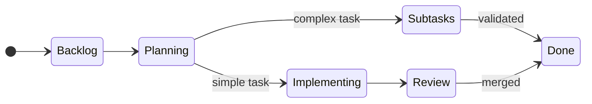

# whip — it's not slavery since I'm paying for the tokens, right?

A terminal UI application that supervises and orchestrates multiple Claude Code instances.

> **⚠️ Experimental Project**
>
> This is a highly experimental project that is heavily vibe-coded. Expect rough edges, breaking
> changes, and general chaos. Use at your own risk!

## Overview

**whip** is a Rust-based TUI that acts as an "engineering manager" for AI coding agents, spawning
and coordinating multiple Claude Code subprocesses to tackle complex, parallelizable work.

### Intended Workflow

**whip** manages GitHub issues through a Kanban-style workflow, keeping a bounded amount of work
in-flight and driving tasks to completion with human oversight at key decision points.

#### Repository Activation

Activate one or more GitHub repositories in whip. Once activated, whip periodically scans for new
issues and updates to existing ones.

#### Issue Lifecycle Labels

whip uses labels to track task state:

| Label                           | Meaning                                               |
| ------------------------------- | ----------------------------------------------------- |
| `whip/selected-for-development` | Backlog — ready to be picked up                       |
| `whip/in-progress`              | Active — an agent is working on this                  |
| `whip/under-review`             | PR submitted — awaiting human review                  |
| `whip/done`                     | Completed — PR merged                                 |
| `whip/abandoned`                | Deliberately abandoned (human closed or now obsolete) |
| `whip/failed`                   | Could not complete — requires human attention         |

Sub-status labels provide finer granularity within `in-progress`:

- `whip/status/planning` — working on a plan
- `whip/status/implementing` — writing code
- `whip/status/awaiting-subtasks` — waiting for sub-tasks to complete
- `whip/status/validating` — verifying sub-task results

#### Task Flow

Terminal states `abandoned` and `failed` can be reached from most states (see details below).

#### Detailed Flow

1. **Clarification** — The agent asks questions via issue comments until it understands the task.

2. **Planning** — The agent proposes a plan as an issue comment. The human reacts:
   - 👍 **Approve** — Proceed; sub-tasks (if any) require individual plan approval
   - 🚀 **Approve + delegate** — Proceed; sub-task plans are auto-approved
   - 👎 **Disapprove** — Must include feedback; agent iterates on the plan

3. **Sub-task creation** — For complex plans, the parent task spawns sub-tasks (referencing the
   parent issue) and enters `awaiting-subtasks` state. Sub-tasks follow the same workflow but do not
   create further sub-tasks.

4. **Implementation** — Each task runs in an isolated jj workspace (created/cleaned up
   automatically). Multiple agents can work on different tasks in parallel.

5. **Review cycle** — Once a PR is submitted, the task moves to `under-review`. Review feedback
   moves it back to `in-progress` until a new iteration is pushed. This repeats until approval.

6. **Validation** — When all sub-tasks complete, the parent task runs a validation pass. If issues
   are found, it returns to planning; otherwise it completes.

7. **Completion** — On PR merge (or successful validation for parent tasks), the task is marked
   `done`.

8. **Failure modes**:
   - **Abandoned** — Human closes the issue, or agent determines the task is obsolete
   - **Failed** — Repeated implementation failures, agent loops, or sub-task failures; UI alerts the
     human

## License

This project is licensed under the [MIT License](LICENSE).
